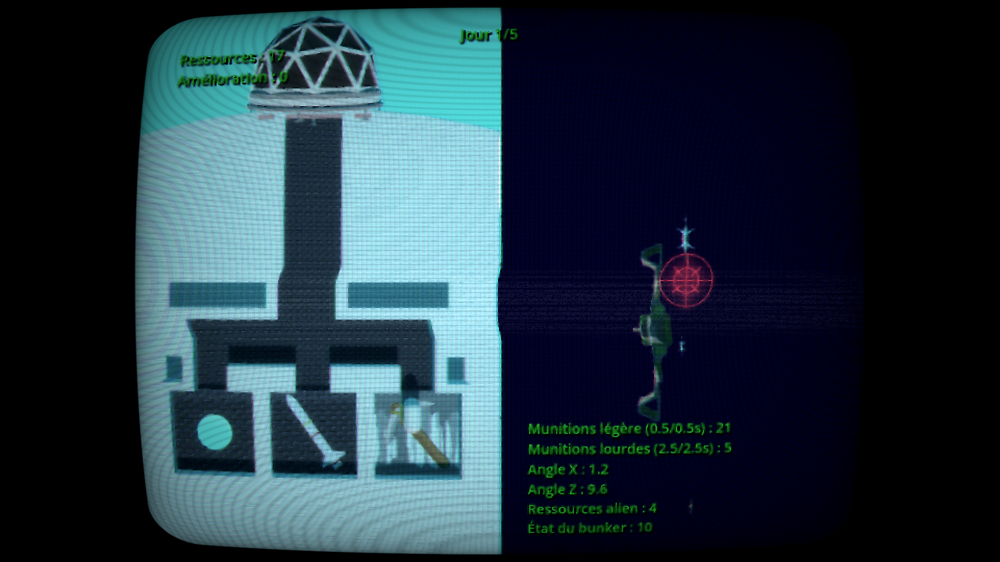

# Earth Defenders
  Défendez la Terre contre une invasion extraterrestre, en coopération locale à 2.

---

Jeu Godot fait en 2 jours pendant l'[ImaJam25](https://itch.io/jam/imajam-2025).

Vous et votre collègue sont chargés de protéger la Terre coûte que coûte. Heureusement, les extraterrestres n'attaquent que de l'hémisphère où il fait nuit sur Terre, donc, pendant que votre camarade défend, vous devrez miner des ressources afin d'alimenter son canon en munitions, et inversement. La destruction de vaisseaux accroît la puissance de votre pioche, ce qui vous permettra de récolter davantage de minerais.

### Contrôles
- Côté gauche
  - Z/Q/S/D : déplacement
  - A : miner/construire munition ou tirer une boule de lumière
  - E : tirer un missile

- Côté droit
  - I/J/K/L : déplacement
  - U : miner/construire munition ou tirer une boule de lumière
  - O : tirer un missile

### Capture d'écran

### Assets
- Geodesic Dome : https://poly.pizza/m/T7Ge6maWq4
- Spaceship 1 : https://poly.pizza/m/5nWeu4IQXVX
- Spaceship 2 : https://poly.pizza/m/uCeLfsdmNP
- Dungeon Tileset : https://opengameart.org/content/dungeon-tileset-4
- Cave : https://opengameart.org/content/seamless-cave-in-parts
- Pickaxe : https://opengameart.org/content/simple-pickaxe
- Missile : https://poly.pizza/m/1Xid2Qhqn2s
- CRT shader : vidéo youtube, on va la retrouver promis
